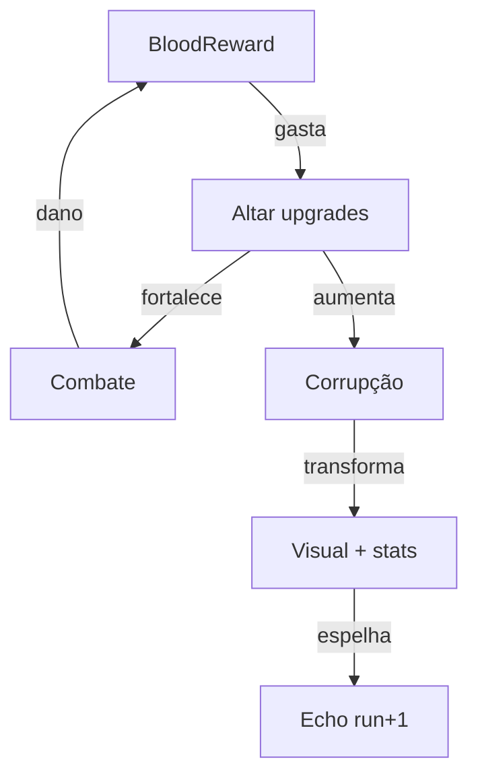
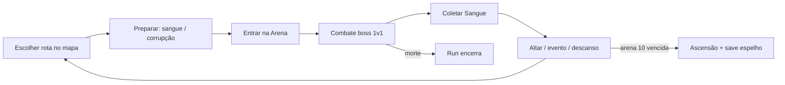
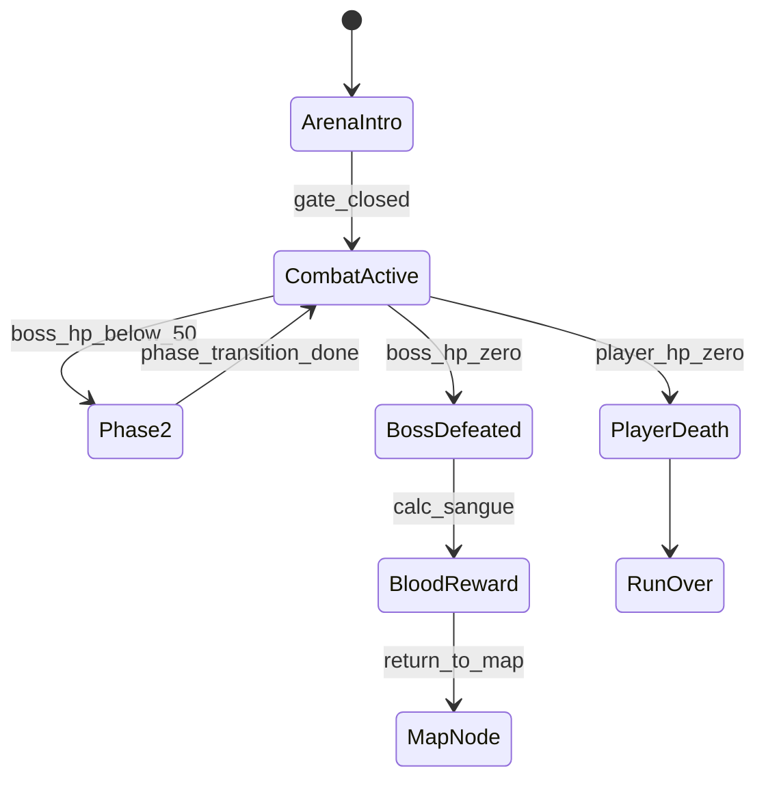
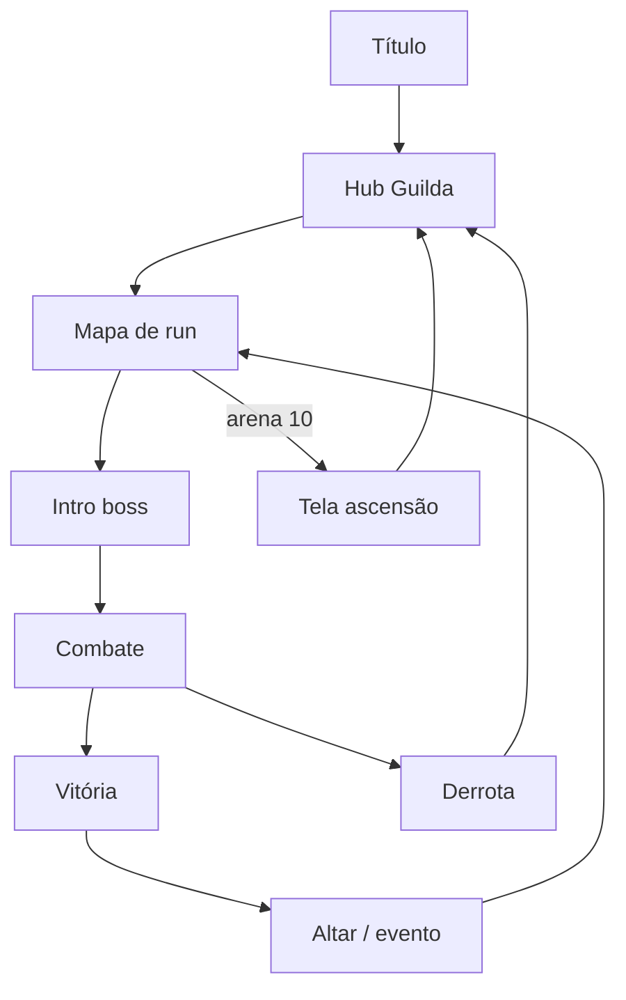

# GDD — Echo Throne v0.1

Documento mestre de design. Primeira versão — conceito, sistemas e catálogo MVP.

> **Título:** Echo Throne · **Tagline:** *Kill the god. Claim the throne. Fight the echo.*

> **Referência visual:** [mockup-arena-01.png](ref/mockup-arena-01.png) — Kael vs Capitão Drakmar, convés em tempestade, UI completa.

---

## Índice

1. [Visão geral](#1-visão-geral)
2. [Pilares de design](#2-pilares-de-design)
3. [Referências](#3-referências)
4. [Narrativa e mundo](#4-narrativa-e-mundo)
5. [Core gameplay loop](#5-core-gameplay-loop)
6. [Estrutura de uma run](#6-estrutura-de-uma-run)
7. [Combate](#7-combate)
8. [Economia — Sangue Primordial](#8-economia--sangue-primordial)
9. [Corrupção](#9-corrupção)
10. [Boss Echo e ascensão](#10-boss-echo-e-ascensão)
11. [UI / UX](#11-ui--ux)
12. [Arte e direção visual](#12-arte-e-direção-visual)
13. [Arquitetura técnica (alvo)](#13-arquitetura-técnica-alvo)
14. [Conteúdo MVP — catálogo inicial](#14-conteúdo-mvp--catálogo-inicial)
15. [Riscos, perguntas em aberto e roadmap](#15-riscos-perguntas-em-aberto-e-roadmap)

---

## 1. Visão geral

### Identidade

| Campo | Valor |
|-------|-------|
| **Título** | Echo Throne |
| **Tagline** | *Kill the god. Claim the throne. Fight the echo.* |
| **Codinome técnico** | `echo-throne` |
| **Facção no lore** | Guilda dos Caçadores (organização in-world; não é o título do jogo) |

### Elevator pitch

O mundo acabou há séculos. Restaram apenas as **Arenas** — prisões circulares onde Deuses Corrompidos agonizam, alimentando um ciclo sem fim. Você é **Kael**, caçador da Guilda: não luta por glória, mas para extrair o **Sangue Primordial** — memória condensada em fluido, capaz de remodelar o corpo humano. Cada vitória enche suas veias de poder; cada melhoria no Altar aproxima você da mesma corrupção que aprisiona os deuses. Ao fim de dez arenas, o **Trono** espera — e quem ocupa seu lugar deixa um **eco** para sempre. Na run seguinte, o desafio final pode ser **você**: o caçador que venceu antes.

### Gênero

| Aspecto | Definição |
|---------|-----------|
| **Tipo** | Action Boss Rush roguelite |
| **Perspectiva** | Top-down oblíqua, pixel art |
| **Tom** | Dark fantasy, melancólico, tensão souls-like |
| **Plataforma** | Navegador desktop (mouse + teclado) |
| **Duração** | Run completa: 45–90 min; boss individual: 3–8 min (após aprendizado) |
| **Idade** | 14+ |

### Fantasia do jogador

Você é o caçador mais ágil da Guilda — pequeno diante dos titãs, mas letal se souber ler o padrão. Cada arena é um duelo de movimento: esquivar no último instante, quebrar a guarda com parry, punir a janela aberta. O sangue dos deuses fortalece suas mãos; a corrupção transforma seu reflexo no espelho.

### O que este jogo **é**

- **Boss Rush** puro — arena após arena, sem filler de mobs comuns
- **Combate real-time** com esquiva, parry, combos e habilidades
- **Roguelite de rota** — mapa de nós entre arenas, escolhas de caminho
- **Economia de sangue** — quanto mais dano ao boss, mais moeda para upgrades
- **Corrupção progressiva** — poder com custo visual e mecânico
- **Meta-narrativa** — vencedor de uma run vira o **Echo** na próxima

### O que **não** é

- Exploração estilo Zelda (Death's Door)
- One-hit kill (Titan Souls)
- Combate por cartas (Pacto Sombrio card game)
- Masmorra procedural com captura (Snaredusk)
- Multiplayer ou mobile no MVP

---

## 2. Pilares de design

| Pilar | Na prática | Exemplo de corte de escopo |
|-------|------------|---------------------------|
| **Leitura antes de reflexo** | Padrões telegrafados, janelas de punição claras | Sem ataques frame-1 sem aviso visual |
| **Boss como puzzle de movimento** | Cada arena é encontro único; observar > grindar | Sem stats inflados para compensar falta de skill |
| **Sangue tem preço** | Moeda = poder = corrupção; build com trade-off | Upgrades gratuitos sem custo de corrupção |
| **Escala dramática** | Protagonista ~1/3 do boss; arena ampla | Bosses não encolhem para caber na tela |
| **Runs que se lembram** | O Echo carrega vestígios da run vencedora | Runs idênticas sem persistência narrativa |

### Tensão central



---

## 3. Referências

### O que absorvemos e o que não copiamos

| Jogo / projeto | Absorver | Não copiar |
|----------------|----------|------------|
| **Death's Door** | Esquiva com i-frames, ritmo melee→habilidade, bosses com fases, arenas cinematográficas, janelas de punição pós-combo | Exploração Zelda-like, mundo aberto entre dungeons, ausência de parry dedicado |
| **Titan Souls** | Foco 1v1, weak points, arena como palco, tensão de posicionamento, overworld mínimo entre titãs | One-hit kill, flecha única, sem progressão de HP |
| **Slay the Spire** | Mapa de nós entre combates, escolha de rota, eventos com escolha | Combate por cartas, turnos |
| **Snaredusk** (interno) | Pixi 480×270, `bossMechanics` state machine, fase 2 em 50% HP, hitboxes separadas do sprite, DOM HUD para boss | Masmorra procedural, captura, habitat, ciclo dia/noite, loja cozy |

### Nota de design — parry e perfect dodge

Death's Door não possui parry dedicado (apenas deflect de projéteis com o Umbrella). **Echo Throne** adiciona **parry** e **perfect dodge** como pilares explícitos de skill expression, diferenciando o combate e recompensando leitura de padrões.

---

## 4. Narrativa e mundo

### Premissa

Há séculos, o mundo **acabou**. Não restaram reinos, nem cidades — apenas as **Arenas**: estruturas colossais espalhadas pelo que sobrou da terra, cada uma aprisionando um **Deus Corrompido**. Eles não morrem. Sangram eternamente, e de seu sangue nasceu uma nova economia.

### A Guilda dos Caçadores

A Guilda não mata monstros por glória nem por dever sagrado. Os caçadores entram nas Arenas para **extrair Sangue Primordial** — fluido que carrega memória e poder. Quanto mais poderoso o deus, mais sangue ele produz quando ferido. Esse sangue, refinado no Altar, pode fortalecer o corpo humano além dos limites naturais.

Mas cada melhoria aproxima o caçador da **corrupção** — a mesma força que transformou deuses em prisioneiros agonizantes.

### Sangue Primordial

| Propriedade | Descrição |
|-------------|-----------|
| **Origem** | Extraído de deuses e bosses corrompidos durante o combate |
| **Função econômica** | Moeda de run — gasta no Altar entre arenas |
| **Função narrativa** | Memória condensada; upgrades "lembram" poderes dos deuses derrotados |
| **Função mecânica** | Alimenta barra de Corrupção conforme volume e tipo de pacto |

### Corrupção — arco visual

Quanto mais sangue absorvido, mais o personagem muda:

| Nível | Aparência |
|-------|-----------|
| 1 | Normal |
| 2 | Veias escuras aparecem sob a pele |
| 3 | Olhos vermelhos, pupilas dilatadas |
| 4 | Braço parcialmente monstruoso |
| 5 | Quase um boss — postura, escala parcial |
| 6 | Deus corrompido — forma final |

Detalhes mecânicos na [seção 9](#9-corrupção).

### O ciclo das Arenas

Cada Arena segue o mesmo ritual:

1. Caçador recebe permissão da Guilda
2. Escolhe rota no mapa de nós
3. Enfrenta o deus aprisionado
4. Extrai sangue proporcional ao dano causado
5. Fortalece-se no Altar — ou avança ferido
6. Repete até a Arena 10
7. **Ascende** ao trono — torna-se o novo guardião da última prisão

Na run seguinte, quem ocupava o trono **desce** como o 11º desafio: o **Echo** — o espelho vivo do vencedor anterior.

### Kael — protagonista

| Campo | Valor |
|-------|-------|
| **Nome** | Kael |
| **Visual** | Cabelo branco espetado, lenço azul, armadura escura, espada prateada |
| **Papel** | Caçador de elite da Guilda; uma das poucas almas que ainda resistem à corrupção total |
| **Motivação** | Extrair sangue suficiente para... *(a definir: salvar alguém? quebrar o ciclo? ascender de propósito?)* |
| **Tom** | Silencioso, eficiente, cada movimento calculado |

Backstory expandida fica para v0.2; o GDD fixa identidade visual e papel mecânico.

### Bosses — Deuses Corrompidos

Cada boss é um deus antigo, reduzido a prisioneiro de sua própria Arena. Não são "monstros genéricos" — têm nome, história de queda e moveset que reflete quem foram antes da corrupção.

**Exemplo — Arena 1:** **Capitão Drakmar**, deus dos mares antes da Queda; agora amarrado ao convés fantasma de seu navio, eternamente em tempestade.

---

## 5. Core gameplay loop

### Macro-loop (run completa)



### Micro-loop (30 segundos de combate)

1. **Posicionar** — manter distância segura, ler telegraph do boss
2. **Esquivar ou parry** — i-frames na esquiva; stagger no parry bem-sucedido
3. **Combo melee** — 2–3 hits na janela aberta
4. **Gastar energia** — habilidade (ex.: Investida) em momento de alto valor
5. **Recuar** — boss retoma padrão; repetir

### Estados do jogador (fora de combate)

| Estado | Onde | Sangue | Corrupção |
|--------|------|--------|-----------|
| Hub da Guilda | Menu / meta-progressão | — | Persistente entre runs |
| Mapa de run | Escolha de nós | Acumulado na run | Acumulada na run |
| Altar | Gastar sangue | Gasta | Sobe conforme upgrade |
| Arena | Combate ativo | Ganha por dano | — |
| Morto | Fim de run | Perdido | Parcialmente persistido para espelho |

---

## 6. Estrutura de uma run

### Visão geral

- **10 arenas principais** por run — cada uma com 1 boss único
- **Mapa de nós** entre arenas (estilo Slay the Spire, simplificado)
- **Boss final (arena 10):** Deus Corrompido supremo da run
- **Arena 11 (run 2+):** **The Echo** — opcional, desbloqueado após ascensão anterior
- **Morte em qualquer arena:** fim da run; meta-progressão permanente mantida

### Mapa de nós

Entre cada arena obrigatória, o jogador escolhe caminho em um grafo horizontal:

```
[Boss 1] → [nó] → [nó] → [Boss 2] → … → [Boss 10]
            ↓       ↓
         Altar   Evento
```

| Tipo de nó | Ícone (mockup) | Função |
|------------|----------------|--------|
| **Boss** | Caveira | Combate obrigatório para avançar de "andar" |
| **Altar do Sangue** | Baú / altar | Gastar sangue em upgrades |
| **Evento** | ? / espadas cruzadas | Escolha narrativa com trade-off |
| **Descanso** | Fogueira | Cura 25% HP máx; sem custo |

**Regra de progressão:** cada "andar" do mapa tem exatamente 1 nó de boss. Os nós intermediários são opcionais (1–2 escolhas antes do próximo boss).

**Label de UI:** `ARENA X/10` (mockup: Arena 3/10) — indica progresso na run atual.

### Falha e retry

| Situação | Consequência |
|----------|--------------|
| HP = 0 na arena | Run encerra; volta ao hub da Guilda |
| Abandonar run | Mesmo que morte (sem recompensa parcial no MVP) |
| Vencer arena 10 | Ascensão; save de espelho; meta-moeda permanente |

---

## 7. Combate

### Modelo

- **Real-time action** top-down oblíquo
- Câmera segue jogador com leve lookahead na direção do movimento
- **HP tradicional** — jogador e boss têm pools de vida (não one-hit kill)
- Stamina só para **esquiva**; energia para **habilidades**

### Recursos do jogador

| Recurso | Base (Kael) | Função | Regeneração |
|---------|-------------|--------|-------------|
| **HP** | 180 | Sobrevivência | Poções, descanso, upgrades |
| **Energia** | 60 | Habilidades (ex.: Investida, custo 15) | +3/s passivo; +5 por hit melee |
| **Stamina** | 100 | Esquiva (dash) | +25/s fora de esquiva; 0.4s delay após esquiva |

*Valores do mockup: HP 162/180, Energia 60/60.*

### Ações do jogador

| Ação | Input | Detalhe |
|------|-------|---------|
| **Movimento** | WASD | 120 px/s base |
| **Ataque melee** | Mouse esquerdo / Espaço | Combo de 3 hits; cancelável em esquiva após hit 1 |
| **Esquiva** | Shift | 0.25s i-frames; custo 25 stamina; deslocamento 48 px |
| **Perfect Dodge** | Shift no frame do impacto | Janela 0.12s antes do hit; restaura 15 energia + slow no boss 0.5s |
| **Parry** | Botão direito (bloqueio) | Janela 0.18s no início do block; sucesso = stagger 1.2s + riposte crítica (2× dano) |
| **Habilidade** | Q | Slot único no MVP; cooldown + custo energia |
| **Poção** | 1 / scroll | Quick slot; 3 cargas no mockup; cura 40 HP |

### Combo melee

| Hit | Dano base | Tempo | Notas |
|-----|-----------|-------|-------|
| 1 | 12 | 0.15s windup | Abre combo |
| 2 | 14 | 0.12s | — |
| 3 | 20 | 0.20s | Finisher; knockback leve |

**Riposte (após parry):** 1 hit garantido, 40 dano, não gasta stamina.

### Boss design rules

| Regra | Valor / descrição |
|-------|-------------------|
| **Tamanho da arena** | ~360×280 px jogáveis (viewport 480×270) |
| **Escala visual** | Boss 2.5–3.5× altura do protagonista |
| **Fase 2** | Ativada em ≤50% HP; moveset acelerado ou nova mecânica |
| **Telegraph** | Toda ameaça grave: cor + som + ≥0.4s windup |
| **Weak point** | Opcional por boss; exposto após stagger ou mecânica de arena |
| **Janela de punição** | 1.5–2.5s após combo do boss (padrão Death's Door) |

### State machine da arena



### Fórmula de recompensa de sangue

```
sangue_ganho = floor(dano_total_causado × mult_boss × mult_perfect)

mult_boss:     1.0 (arena 1) → 2.5 (arena 10)
mult_perfect:  1.0 base; +0.1 por perfect dodge (máx +0.5); +0.2 por parry que levou a kill
```

**Bônus de vitória completa:**

```
sangue_bônus = floor(hp_max_boss × 0.15 × mult_boss)
```

- Incentiva agressão (mais dano = mais sangue durante o fight)
- Vitória limpa ainda recompensa sem exigir perfect play

### Habilidade inicial — Investida

| Campo | Valor |
|-------|-------|
| **Nome** | Investida |
| **Custo** | 15 energia |
| **Cooldown** | 4s |
| **Efeito** | Dash ofensivo 64 px; 25 dano no trajeto; i-frames 0.15s |
| **Uso** | Gap-close, punish após stagger, escape de canto |

---

## 8. Economia — Sangue Primordial

### Moeda de run

- **Nome na UI:** SANGUE
- **Exibição:** top-right, ícone de gota + valor numérico (mockup: 2.845)
- **Persistência:** apenas dentro da run; perdido ao morrer
- **Exceção:** vitória na arena 10 converte 10% em **Essência** (meta-moeda permanente)

### Gastos no Altar

| Categoria | Exemplos | Corrupção |
|-----------|----------|-----------|
| **Vitalidade** | +20 HP máx | +2% |
| **Lâmina** | +8% dano melee | +3% |
| **Reflexos** | +0.02s janela parry | +2% |
| **Essência** | −3 custo energia habilidade | +4% |
| **Pacto** | +15% dano global | +12% |
| **Pacto** | Habilidade corrompida (variante) | +15% |

### Regras do Altar

1. Cada visita oferece **3 opções** aleatórias (peso por categoria)
2. Upgrades empilham até cap por categoria (definido no catálogo)
3. **Pacto** sempre aparece como 1 das 3 opções a partir da arena 4
4. Recusar todas as opções é permitido (sem custo)

### Meta-moeda — Essência

| Fonte | Quantidade |
|-------|------------|
| Vencer arena 10 | 10% do sangue da run → Essência |
| Derrotar The Echo | 50 Essência flat |
| Primeira vitória por boss | 10 Essência (bestiário) |

**Gastos permanentes (hub da Guilda):**

- Desbloquear habilidades alternativas
- +5 HP base por nível (máx 5 níveis)
- Entradas de bestiário com lore

---

## 9. Corrupção

### Barra de Corrupção

- **UI:** bottom-center, barra roxa, label CORRUPÇÃO (mockup ~30%)
- **Escala:** 0–100%
- **Sobe:** upgrades no Altar, certos eventos, Pactos
- **Não desce** durante a run (sem "limpar" corrupção no MVP)

### Estágios

| Estágio | Corrupção | Visual | Bônus | Penalidade |
|---------|-----------|--------|-------|------------|
| 1 — Humano | 0–15% | Normal | — | — |
| 2 — Marcado | 16–30% | Veias escuras | +5% lifesteal melee | Eventos "luz" bloqueados |
| 3 — Sedento | 31–50% | Olhos vermelhos | +10% dano | −5% cura recebida |
| 4 — Transformado | 51–70% | Braço monstruoso | Habilidade corrompida desbloqueada | −0.02s janela parry |
| 5 — Abominação | 71–90% | Quase boss | +20% HP máx | Apenas eventos sombrios |
| 6 — Deus menor | 91–100% | Forma corrompida completa | Build "final form" (+30% dano, +15% speed) | Final alternativo (sem "redenção") |

### Habilidade corrompida (estágio 4+)

Variante da habilidade equipada com maior poder e custo de corrupção visual permanente na run:

| Base | Corrompida |
|------|------------|
| Investida (dash 64 px, 25 dmg) | **Investida Sangrenta** — dash 80 px, 40 dmg, cura 5% do dano causado; trilha de sangue no chão |

### Corrupção e Boss Espelho

O nível de corrupção ao ascender **define o visual e parte do moveset** do Espelho na run seguinte (ver seção 10).

---

## 10. Boss Echo e ascensão

### Ascensão (vencer arena 10)

Ao derrotar o Deus Corrompido final:

1. Cutscene curta — Kael ocupa o trono da Arena
2. **Echo save** gravado em `localStorage`:
   - Nível de corrupção (%)
   - Estágio visual (1–6)
   - 2 upgrades aleatórios escolhidos do Altar na run
   - Habilidade equipada (+ variante corrompida se aplicável)
   - Total de sangue ganho na run
3. Conversão de 10% do sangue → Essência
4. Retorno ao hub da Guilda

### Boss Echo (run 2+)

| Campo | Regra |
|-------|-------|
| **Quando** | Desbloqueado após existir Echo save |
| **Onde** | Nó secreto após arena 10 (11º desafio opcional) |
| **Identidade** | "Kael Echo" — ou nome do caçador + sufixo do estágio de corrupção |
| **Visual** | Estágio de corrupção do save; paleta invertida |
| **Stats** | HP = média dos bosses 8–10; ATK escalado por corrupção |
| **Moveset** | Investida (+ variante corrompida se estágio ≥4) + 2 padrões herdados dos upgrades salvos |
| **Vitória** | 50 Essência + entrada de bestiário + final "Quebra de Ciclo" |

**Recomendação de pacing:** o Echo **não substitui** o boss 10 — é desafio pós-run para jogadores que completaram as 10 arenas na mesma run. Evita quebrar o arco das 10 arenas na run 2.

### IA do Echo

| Abordagem MVP | Scriptado por estágio de corrupção |
|---------------|-------------------------------------|
| Estágio 1–3 | Padrões defensivos; punição conservadora |
| Estágio 4–5 | Agressivo; usa habilidade corrompida |
| Estágio 6 | Fase 2 imediata; arena encolhe (hazard) |

IA "replay do jogador" fica como stretch goal pós-MVP.

---

## 11. UI / UX

### Layout em combate (do mockup)

```
┌─────────────────────────────────────────────────────────────┐
│ [Retrato]  HP ████████  EN ██████  [slots]    SANGUE 2845 │
│             162/180      60/60    ⚔🛡🧪3                   │
│              CAPITÃO DRAKMAR                                │
│              Boss HP ████████████████████  9640/15000     │
│                                                             │
│                    [ ARENA DE COMBATE ]                   │
│                                                             │
│ HABILIDADE          CORRUPÇÃO ████░░░░░░        ARENA 3/10│
│ [Investida]                                              🗺│
│ (CUSTO: 15)                                                 │
└─────────────────────────────────────────────────────────────┘
```

| Zona | Conteúdo |
|------|----------|
| **Top-left** | Retrato Kael, barra HP (vermelho), barra Energia (azul), quick slots |
| **Top-center** | Nome do boss, barra HP grande |
| **Top-right** | Contador SANGUE |
| **Bottom-left** | Habilidade equipada: ícone, nome, custo |
| **Bottom-center** | Barra CORRUPÇÃO (roxo) |
| **Bottom-right** | Progresso ARENA X/10 + minimapa de nós |

### Quick slots

| Slot | Conteúdo (mockup) |
|------|-------------------|
| 1 | Arma atual |
| 2 | Escudo / parry |
| 3 | Poção (×3 cargas) |

### Fluxo de telas



### Feedback de combate

| Evento | Feedback |
|--------|----------|
| Perfect dodge | Flash branco + som agudo + +energia UI |
| Parry | Faísca dourada + freeze 0.1s + stagger boss |
| Fase 2 boss | Tela treme + barra HP muda cor + música intensifica |
| Corrupção sobe | Pulso roxo na barra + som grave |

---

## 12. Arte e direção visual

### Especificações técnicas

| Parâmetro | Valor |
|-----------|-------|
| Resolução interna | 480×270 |
| Upscale | Inteiro (floor), nearest-neighbor |
| Antialias | false |
| Tile base | 32×32 px |
| Perspectiva | Top-down oblíqua com Y-sort |

### Paleta

| Uso | Cores |
|-----|-------|
| Ambiente | Azuis e cinzas frios, chuva, madeira escura |
| Acentos quentes | Lanternas âmbar, sangue carmesim |
| UI | Pedra/metal escuro, bordas gravadas |
| Corrupção | Roxo profundo, veias negras |
| Boss | Saturação alta para contraste com cenário |

### Animação

| Entidade | Frames alvo |
|----------|-------------|
| Kael | 6 walk, 4 attack ×3, 3 dodge, 2 parry |
| Boss médio | 8 idle, 6 attack variants, 4 fase 2 |
| VFX telegraph | 3–5 frames, cores distintas por tipo de ameaça |

### Arena de referência — Capitão Drakmar

- **Cenário:** convés circular de navio pirata, grade de madeira, barris, cordas, bandeira Jolly Roger
- **Clima:** tempestade, chuva em overlay, mar agitado ao redor
- **Iluminação:** lanternas quentes nas amuradas vs céu frio
- **Escala:** Drakmar ~3× Kael; ocupa terço superior da arena

---

## 13. Arquitetura técnica (alvo)

> Seção descreve intenção para implementação futura. **Não implementar no escopo do GDD.**

### Stack proposta

| Camada | Tecnologia |
|--------|------------|
| Build | Vite 8 + TypeScript 6 |
| Render | PixiJS 8 (WebGL2) |
| Testes | Vitest (sistemas puros) |
| Áudio | Web Audio API (SFX procedural no MVP) |
| Save | localStorage versionado |

### Estrutura de pastas

```
echo-throne/
  src/
    engine/       constants, camera, input, ySort, fxRunner
    scenes/       arenaScene.ts, hubScene.ts, mapScene.ts
    systems/      combat, bossMechanics, bossPhase, parry, perfectDodge,
                  bloodEconomy, corruption, mapGenerator
    data/         bosses.ts, upgrades.ts, corruptionStages.ts, events.ts
    world/        tileRenderer, arenaLayouts, creatureAssets, playerAssets
    ui/           bossHudUI, mapUI, altarUI, corruptionUI
  public/assets/  spritesheets, áudio
  tests/          combat, parry, bloodEconomy, bossMechanics
  design/         GDD, referências
```

### Reuso do Snaredusk

| Módulo Snaredusk | Uso direto |
|------------------|------------|
| `bossMechanics.ts` | State machine arena (intro → active → done) |
| `bossPhase.ts` | Fase 2 em 50% HP |
| `enemyBehaviors.ts` | Template de AI data-driven |
| `enemyHitboxes.ts` | Hitbox separada do sprite |
| `combat.ts` | `calcDamage`, `distance`, arcos de ataque |
| `creatureAssets.ts` | Pipeline de atlas + nearest-neighbor |
| `bossHudUI.ts` | HUD de boss em DOM |

### Módulos novos (pós-GDD)

| Módulo | Responsabilidade |
|--------|------------------|
| `parry.ts` | Janela, stagger, riposte |
| `perfectDodge.ts` | Detecção frame-perfect, bônus |
| `bloodEconomy.ts` | Fórmula de sangue, gastos no Altar |
| `corruption.ts` | Estágios, bônus/penalidades |
| `mapGenerator.ts` | Grafo de nós entre arenas |
| `mirrorBoss.ts` | Load save, montar boss espelho |

### Constantes iniciais (proposta)

```typescript
export const GAME_WIDTH = 480;
export const GAME_HEIGHT = 270;
export const ARENA_WIDTH = 360;
export const ARENA_HEIGHT = 280;
export const DODGE_STAMINA_COST = 25;
export const DODGE_DURATION = 0.25;
export const PARRY_WINDOW = 0.18;
export const PERFECT_DODGE_WINDOW = 0.12;
```

---

## 14. Conteúdo MVP — catálogo inicial

### Roster de bosses (10 arenas)

| # | Nome | Arena | Tema | Mecânica assinatura | HP base |
|---|------|-------|------|---------------------|---------|
| 1 | **Capitão Drakmar** | Convés navio | Pirata / tempestade | Onda de convés + gancho | 1.500 |
| 2 | **Sacerdotisa das Marés** | Ruínas alagadas | Templo submerso | Círculos de maré que empurram | 2.000 |
| 3 | **O Carrasco de Ferro** | Forja abandonada | Industrial sombrio | Bigorna que cai (telegraph no chão) | 2.200 |
| 4 | **Matriarca das Cinzas** | Vila queimada | Fogo / perda | Rastros de fogo + fase 2: inferno | 2.500 |
| 5 | **O Arquivista** | Biblioteca infinita | Conhecimento | Projéteis de páginas + weak point nas estantes | 2.800 |
| 6 | **Senhor dos Espelhos** | Salão de cristal | Ilusão | Clones falsos; só o real sangra | 3.000 |
| 7 | **A Última Colheita** | Campo morto | Natureza podre | Vinhas que prendem + área de esporos | 3.200 |
| 8 | **General Rachado** | Campo de batalha | Guerra eterna | Onda de soldados espectrais + charge | 3.500 |
| 9 | **O Trono Vazio** | Catedral quebrada | Vazio | Gravidade invertida em setores da arena | 4.000 |
| 10 | **O Deus Esquecido** | Trono da Arena | Amalgama | Fase multi-elemento; usa resquícios dos 9 anteriores | 5.000 |

*HP escalam por run via multiplicador de NG+ (futuro). Mockup Drakmar mostra 15.000 — valor de run avançada ou NG+2.*

### Boss 1 — Capitão Drakmar (detalhado)

| Campo | Valor |
|-------|-------|
| **Lore** | Deus dos mares antes da Queda; amarrado ao convés fantasma de sua frota |
| **Visual** | Bicorne com caveira, casaco vermelho, gancho na mão esquerda, cutlass na direita |
| **Fase 1** | 3 golpes de cutlass (arco frontal); Gancho (puxa jogador); Onda (linha de deck) |
| **Fase 2 (≤50%)** | Tempestade: chuva densa reduz visão; Onda em cruz; summon de 2 tripulantes espectrais (adds fracos) |
| **Weak point** | Costas após combo de 3 — stagger 2s |

### Boss 2 — Sacerdotisa das Marés (esboço)

| Campo | Valor |
|-------|-------|
| **Lore** | Oráculo que previu o fim e se deixou corromper para "salvar" seus fiéis |
| **Mecânica** | Círculos de maré no chão — azul empurra, vermelho puxa; jogador posiciona boss nos círculos |
| **Fase 2** | Maré alta — arena encolhe 20% |

### Boss 3 — O Carrasco de Ferro (esboço)

| Campo | Valor |
|-------|-------|
| **Lore** | Carrasco de um rei morto; executa eternamente sentenças vazias |
| **Mecânica** | Bigorna cai em telegraph 1s; jogador atrai boss para sob a bigorna |
| **Fase 2** | Duas bigornas alternadas |

### Upgrades do Altar (12 para playtest)

| ID | Nome | Categoria | Efeito | Custo sangue | Corrupção |
|----|------|-----------|--------|--------------|-----------|
| U01 | Sangue Forte | Vitalidade | +20 HP máx | 200 | +2% |
| U02 | Segundo Fôlego | Vitalidade | +15 HP máx | 150 | +1% |
| U03 | Lâmina Afiada | Lâmina | +8% dano melee | 250 | +3% |
| U04 | Combo Fluido | Lâmina | Hit 3 +5 dano | 300 | +4% |
| U05 | Reflexos de Caçador | Reflexos | +0.02s parry | 200 | +2% |
| U06 | Passo Leve | Reflexos | −5 stamina esquiva | 180 | +2% |
| U07 | Essência Concentrada | Essência | −3 custo habilidade | 280 | +4% |
| U08 | Reserva Profunda | Essência | +15 energia máx | 220 | +3% |
| U09 | Pacto de Ferro | Pacto | +15% dano global | 400 | +12% |
| U10 | Pacto Sangrento | Pacto | +10% lifesteal | 450 | +15% |
| U11 | Pele de Titã | Vitalidade | +30 HP máx | 500 | +8% |
| U12 | Investida Corrompida | Pacto | Desbloqueia variante corrompida | 600 | +18% |

### Eventos de mapa (3 para playtest)

| ID | Nome | Escolha A | Escolha B |
|----|------|-----------|-----------|
| E01 | Poça de Sangue | Beber (+150 sangue, +8% corrupção) | Coletar com frasco (+80 sangue, +3%) |
| E02 | Caçador Ferido | Curar (+30% HP, −50 sangue) | Roubar sangue dele (+200 sangue, +10% corrupção) |
| E03 | Ecos do Deus | Ouvir memória (+lore, +5% corrupção) | Ignorar (+0) |

### Vertical slice (fase de implementação)

| Entrega | Escopo |
|---------|--------|
| **VS 0.1** | Kael vs Drakmar, 1 arena, combate completo, HUD |
| **VS 0.2** | + Altar, sangue, 3 upgrades |
| **VS 0.3** | + Mapa 3 nós, corrupção, poção |
| **VS 0.4** | + Boss 2, save, hub mínimo |

---

## 15. Riscos, perguntas em aberto e roadmap

### Perguntas em aberto

| # | Pergunta | Impacto | Proposta inicial |
|---|----------|---------|------------------|
| 1 | Parry vs perfect dodge — overlap? | Confusão de inputs | Funções distintas: dodge = evitar; parry = punir melee |
| 2 | Quantos caminhos por andar no mapa? | Duração da run | 2 nós opcionais entre cada boss |
| 3 | Corrupção alta é viável? | Balanceamento | Sim — build corrompida competitiva, não strictly inferior |
| 4 | IA do Espelho: save ou script? | Escopo | Script por estágio no MVP |
| 5 | Meta-progressão entre runs mortas? | Retenção | Essência parcial (5%) + bestiário |
| 6 | HP do boss no mockup (15k) vs tabela (1.5k) | Pacing | Escala por NG+; arena 1 = 1.5k base |
| 7 | ~~Nome final do jogo~~ | — | **Echo Throne** (resolvido) |

### Riscos

| Risco | Mitigação |
|-------|-----------|
| Combate parry+dodge complexo demais | Tutorial interativo na arena 1; forgiving windows no boss 1 |
| Runs longas demais (90 min) | Mapa com atalhos; skip de animações |
| Corrupção visual exige muito arte | 6 estágios como overlay/spritesheet swap, não redraw completo |
| Boss espelho parece injusto | Opcional; telegraph claro; Essência generosa na vitória |
| Escopo de 10 bosses | MVP vertical slice com 3; roster completo em fases |

### Roadmap de produção

| Fase | Entrega | Status |
|------|---------|--------|
| **Agora** | GDD v0.1 + mockup de referência | Este documento |
| **+1** | Paper prototype: mapa + Drakmar em papel | — |
| **+2** | Scaffold técnico (fork snaredusk → arenaScene) | — |
| **+3** | Vertical slice: Kael vs Drakmar jogável | — |
| **+4** | 3 bosses + Altar + corrupção | — |
| **+5** | Mapa completo + 10 bosses + The Echo | — |

---

*GDD v0.1 — Echo Throne. Julho 2026.*
